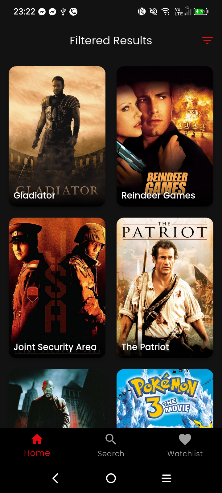
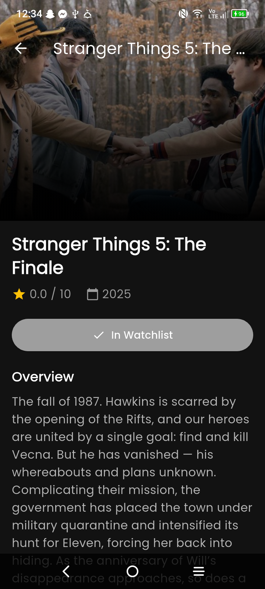
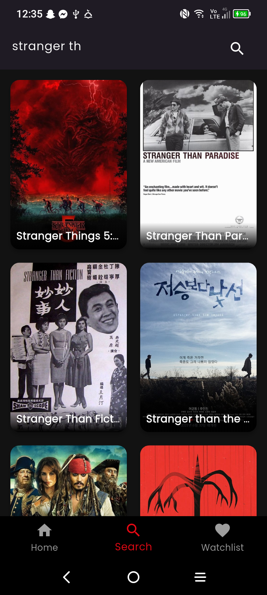
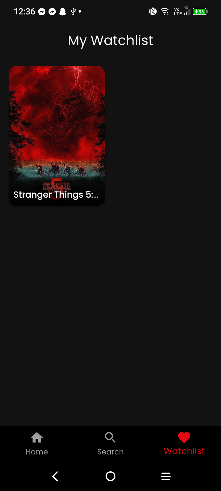

# CineQuest 🎬

**Student:** WAEL FERJANI
**Matricola:** 345352
**Course:** PDMIU 2025-2026

## Overview
CineQuest is a responsive mobile application developed in Flutter that allows users to discover trending movies, search for specific titles, and manage a personal "Watchlist." The app leverages the TMDB API for real-time data and uses local storage to persist user favorites across sessions.

## Features
* **Trending & Discover:** Displays a weekly updated list of popular films. Users can **filter movies by Genre and Year** using an interactive bottom sheet.
* **Smart Search:** Features "Instant Search" (debounced) that fetches results as you type and automatically **sorts them by highest rating**.
* **Detailed View:** Shows high-quality posters, ratings, release dates, and synopses with graceful error handling for missing images.
* **Watchlist:** A persistent "Favorites" list managed with Riverpod and Shared Preferences.
* **Responsive Design:** Adapts the grid layout automatically for mobile (2 columns) and tablet/landscape (4 columns).
* **Robust Error Handling:** Features a custom "No Internet" UI with a retry mechanism for seamless user experience.
* **Custom Branding:** Includes a custom app icon and native splash screen.

## User Experience (UX)
The app features a dark-themed, cinematic interface.
1.  **Browsing:** Users start on the Home tab. They can scroll through trending movies or tap the **Filter icon** to find specific genres (e.g., Sci-Fi from 2023).
2.  **Searching:** The Search tab offers a "Type-to-Search" experience where high-rated results appear instantly without needing to press enter.
3.  **Details:** Tapping any movie card triggers a smooth transition to the Detail Screen.
4.  **Saving:** On the Detail Screen, the "Add to Watchlist" button provides instant visual feedback and saves the selection.
5.  **Reviewing:** The Watchlist tab displays all saved movies, which remain available even after restarting the app.

## Technology Stack
* **Framework:** Flutter & Dart
* **State Management:** `flutter_riverpod` (Chosen for its compile-safe dependency injection and easy testing).
* **Networking:** `http` (For communicating with TMDB API).
* **Persistence:** `shared_preferences` (For storing watchlist IDs locally).
* **UI:** `cached_network_image` (For performance) and `google_fonts` (For typography).
* **Tooling:** `flutter_launcher_icons` & `flutter_native_splash` (For branding).

## Implementation Details
* **Architecture:** The project follows a "Feature-First" architecture, separating the Data Layer (API/Storage) from the Presentation Layer (Widgets/Screens).
* **Responsive Grid:** Used `LayoutBuilder` to dynamically calculate the cross-axis count based on screen width.

## Screenshots

